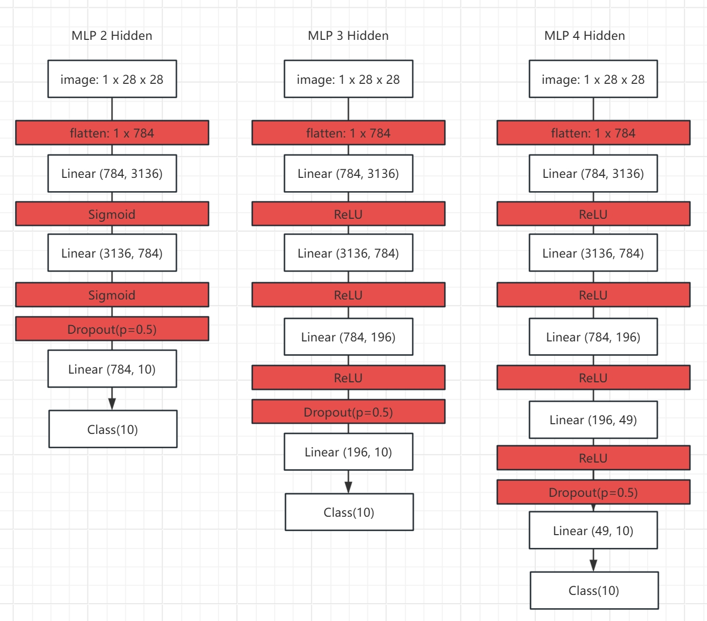
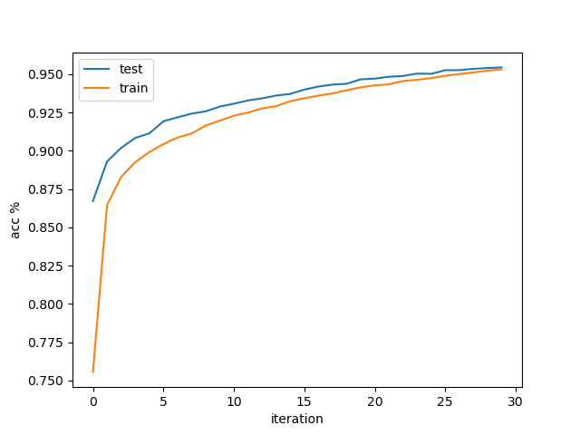
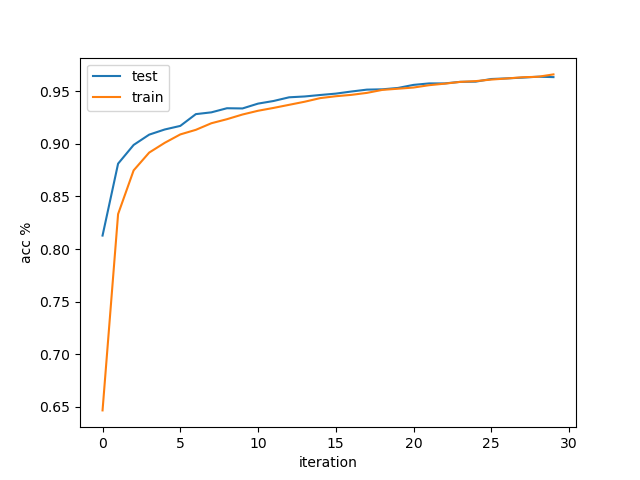
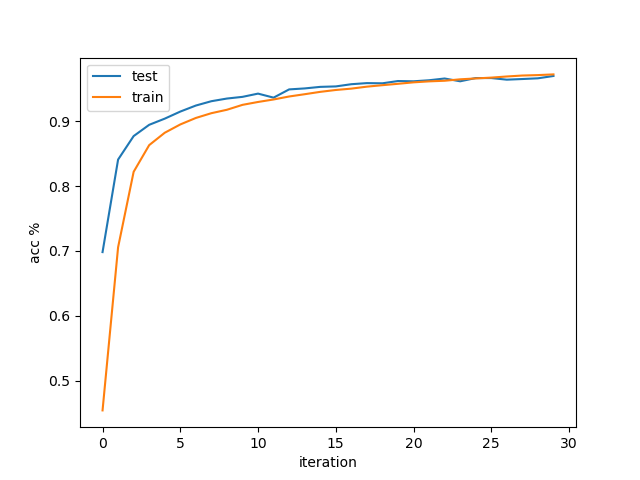
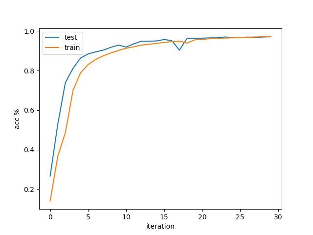
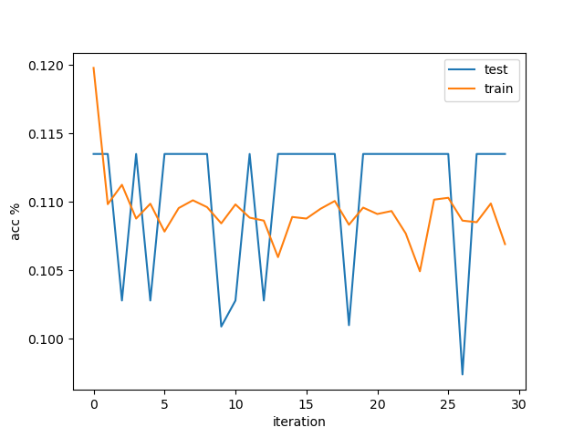
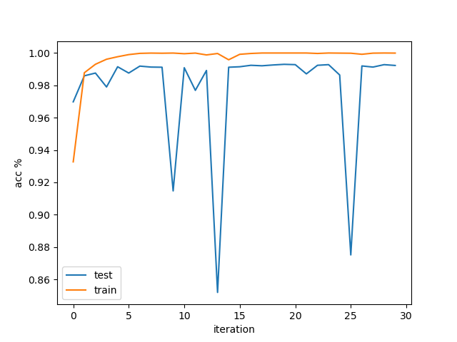

# MNIST数据集手写识别任务

## 任务概述

基于pytorch搭建多种结构的**多层感知机(MLP)**、**LeNet**、**残差神经网络(ResNet)** 对比全连接神经网络、浅层卷积神经网络
和深层卷积神经网络的结构设计、超参数等对性能的影响。研究的网络结果包括：

- 不同隐藏层数量(1,2,3)的多层感知机
- LeNet1 - LeNet5
- ResNet18，ResNet34，ResNet50

## 优化器选取

采用梯度下降法的基础优化器，在每次梯度计算中从数据集中随机抽取少量样本计算。收敛速度一般，表现较为稳定。
考虑收敛速度与性能的平衡，三种网络选择了不同的优化器。本任务采用到的优化器包括两种：

### 冲量法随机梯度下降 ***(torch.optim.SGD)***

pytorch中的sgd支持加入冲量(momentum),冲量法通过对历史的梯度记录做一个滑动平均，
提取出其中震荡较强的分量，并对当前的梯度做一个修正，**去除会导致收敛过程来回
震荡的因素。**

### Adagrad法 ***(torch.optim.Adam)***

Adagrad法通过动态调整学习率**(梯度越大，学习率越小；梯度越小，学习率越大)**使得在收敛点附近学习率尽可能地下降。
基础Adagrad法考虑了所有迭代过程的梯度平方和作为分母，使得后期学习率特别小；而Adadelta法则对迭代过程的梯度记录做了
加权平均，让更近的梯度影响更大，**减缓了学习率的下降**；RMSprop引入了均方根让分母变小，也同样减缓学习率的下降；
Adam法则整合了上述两个方式，用梯度的一阶矩估计和二阶矩估计动态的调整学习率。

## 损失函数选取

由于手写识别任务是多分类问题，我们可以认为分类结果属于**multinoulli分布。**
即总共有k个类别，每次只取一个类别，即$x_j∈\{0,1\}$，将会有：

$$
\sum p_i=1
$$

$$
P(x_j=1)=\Pi_i^k{p_i}^{x_i}
$$

$$
P(x_j=1)=p_i^0 p_2^0…p_j^1…p_k^0=p_j
$$

该分类的似然函数将会是：

$$
argmax\Pi_j^p\Pi_i^k{p_i}^{x_i}
$$

对似然函数取个对数，那就会有：

$$
argmax\sum_j^p\sum_i^kx_i\log{p_i}=argmax\sum_j^p\sum_i^kt_i\log{o_i}
$$

现在想想，$p_i$即是神经网络经过softmax后给出的计算结果，上面这个似然函数取负就是交叉熵损失函数。

## pytorch模块概述

本章节主要记录了实现三种网络过程中涉及到的pytorch模块以及相应的概述

### 数据读取 ***(torch.utils.data.DataLoader)***

任务中提供了独立的MNIST数据集，因而没有采用pytorch内置的MNIST数据集做测试，而是通过重载DataLoader的方式读取自定义的数据。

DataLoader类需要重载三个基本方法***init***,***getitem***与***len***方法。init方法初始化并读取数据，挂载在attribute中，
并根据batch_size自动分割数据集；
getitem方法通过输入index参数的方式返回具体的X与y的tensor
len返回数据集的总条目数
重载的DealDataset类放置在loadData.py中

### 网络结构定义

通过重载**torch.nn.Module**类型编写层或者整个网络。在pytorch中，任何nn.module都被视作是一个**变换**，
即输入一个多维矩阵x经过nn.Module后变为相同结构或不同结构的矩阵x。
按照这个定义，包括softmax、dropout、激活函数、全连接、卷积、池化等乃至整个神经网络都可以用变换进行描述，都是nn.Module
编写中需要重载***init***与***forward***方法，
init方法方法为初始化，一般把网络结构在这部分编写；
forward为正向计算输出时调用的方法。当nn.Module被调用时将会根据自身结构和参数被重定向至这个方法，例如：

self.conv = nn.Linear(100,100) # 100=>100的全连接层
self.conv(x) => x=self.conv.forward(x)

预定义的nn.Module主要有下列几种用于搭建网络结构：

#### nn.Linear(inChannels,outChannels,bias=True)

全连接层，inChannels和outChannels分别为输入和输出的维度，bias表示是否包含偏置，默认包含。
因为全连接层相当于对输入和输出进行一个线性变换，因此**输入的x需要是一个已经拍平的一维的结果**，可通过np.reshape实现

#### nn.conv2d(kernel_size,stride,padding,dilation,bias)

按照设定卷积核进行2d卷积。
当padding=(kernel_size-1)/2且stride=1时矩阵结构将维持不变；
当padding=(kernel_size-1)/2且stride=2时矩阵将降采样为原来的一半。

- kernel_size: 卷积核大小
- stride：卷积核滑动步数
- padding：矩阵填充层数
- bias：是否包含偏置

#### nn.MaxPool1/2/3d(kernel_size,stride,padding)

针对输入的1/2/3维度的平均池化或者最大池化，实际上是按照需求设计特定大小等权重的卷积核对输入进行降维/升维的做法。
当padding=(kernel_size-1)/2且stride=1时矩阵结构将维持不变；
当padding=(kernel_size-1)/2且stride=2时矩阵将降采样为原来的一半。

- kernel_size: 卷积核大小
- stride：卷积核滑动步数
- padding：矩阵填充层数

##### nn.AdaptiveAvgPool1/2/3d,nn.AdaptiveMaxPool1/2/3d

pytorch中贴心的内置了卷积核的设定，只需要对output_size参数直接传入我们想要的、与1/2/3维对应的矩阵结构就可以。

#### nn.ReLU/nn.Sigmoid

激活函数。由于激活的过程可以视作是对输入矩阵做一个函数变换，在pytorch中将其也视作一个层。

#### nn.Softmax/nn.Softmin/nn.Softsign...

对x所有数值的归一化操作可视作对输入矩阵乘起最大/最小值等，在pytorch中将其也视作一个层。

##### nn.BatchNorm

对x不同维度进行归一化的做法，一般用在使用ReLU激活的层中，以防止极端值的出现

#### nn.Dropout(p)

Dropout层将随机地丢弃一些神经元（的输出结果），防止神经网络的过拟合。在pytorch中则是通过抽样的方法对原有矩阵做扰动，也是一个变换。
p表示抽样丢弃的概率

### 其他

#### 优化器optimizer

##### 冲量法随机梯度下降 ***(torch.optim.SGD)***

- parameters:模型参数的tensor
- lr:学习率,默认0.001
- momentum：消除震荡的冲量大小，默认10

##### Adagrad法 ***(torch.optim.Adam)***

- parameters:模型参数的tensor
- lr:学习率,默认0.001
- weight_decay:控制权重衰减的幅度，也称为L2正则项，默认为0

#### torch.device

将参数注入到cpu或者gpu中，有多个gpu时指定cuda:{x}既可以实现并行训练
需要注意网络、参数和输出必须处在同一个device当中才能彼此计算，统一的表达为
device = torch.device("cuda:0")
x.to(device)

## 多层感知机

该部分的网络定义在MLPModel.py中。本任务的多层感知机先将输入数据拍平，经过一个两倍维度的隐藏层后缓慢压缩维度，直至10分类的输出,网络结构如下图：

### 结果

单隐藏层使用SGD优化器收敛时间119s，最大识别准确率95.45%

2隐藏层收敛时间117s，最大识别准确率96.39%

3隐藏层收敛时间115s，最大识别准确率96.98%

4隐藏层收敛时间115s，最大识别准确率97.08%

对4隐藏层的多层感知机（全连接神经网络）尝试使用不同的优化器进行参数估计。
**使用SGD优化器时**，收敛时间115s，最大准确率97.08%  
**使用SGD优化器并采用1冲量时**，收敛时间120s，最大准确率97.38%。
相较而言train误差曲线更为平滑，但test曲线抖动没有明显改善，且在收敛点附近反复横跳  
**使用ADAM优化器时**，epoch2即完成收敛，收敛时间约30s，但最大识别准确率仅为11.35%
根据曲线所示可基本认为模型发散了。

所有测试中测试机和训练集误差变化都较为平缓；由于测试和训练集切分可能存在一些差异，导致模型在测试集中的误差比训练集中更高。
## LeNet

该部分的网络定义在LeNetModel.py中。

## ResNet

该部分的网络定义在resNetModel.py中。网络结构如下：

### 对维度的操作

残差神经网络因为对残差x的变换需要跟输出对应，因而要根据该layer的升维/降采样等进行调整。
在本任务中我们通过一个卷积核为1的二维卷积层(conv2d)实现，通过设置输出通道数对齐第一维，通过滑动步数的设定对齐后两维。
相关方法封装在不同ResNet的self.ResTransform对象中。
由于pytorch内置的交叉熵函数是基于原始输出计算的（可认为内置了softmax层）因而在最后的全连接层后没有增加激活函数层。

### 结果
ResNet 18已经出现过拟合。其收敛总用时1324s，最高精确度可达99.23%,但在epoch==20前后出现明显的震荡。
